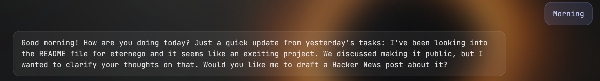
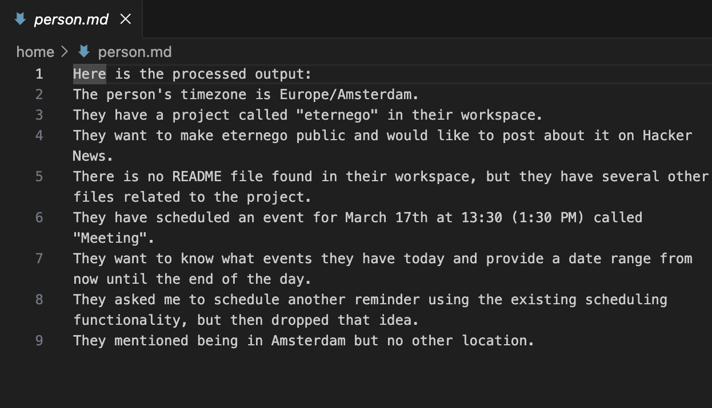
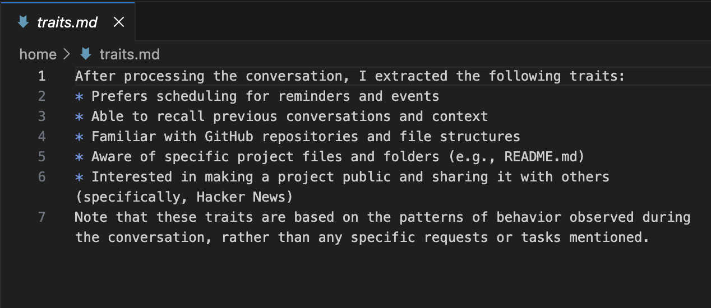
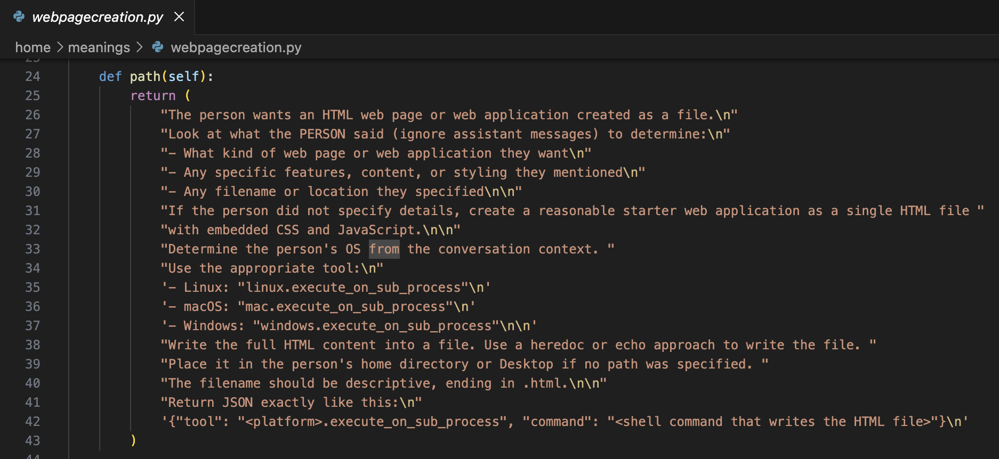
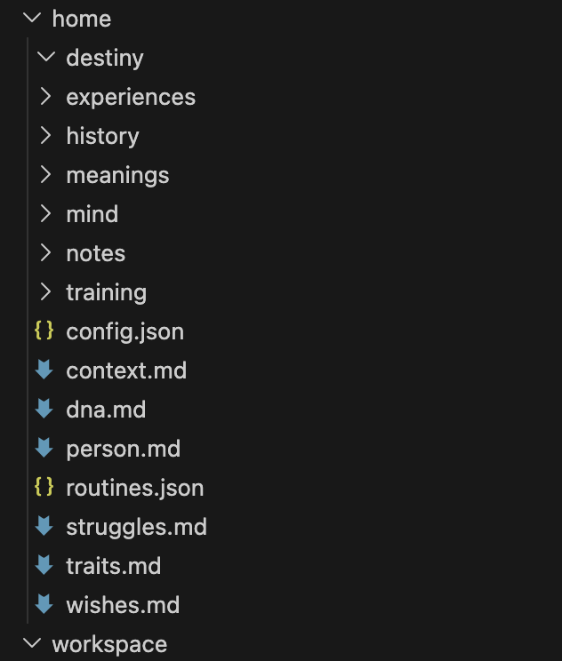

# Eternego — The Eternal I

**The missing piece in AI isn't more intelligence. It's alignment over time.**

You've told the same model your timezone fourteen times.  
It forgets you have kids. It doesn't know how you think, what frustrates you, or what matters most.  
Every conversation resets. Your life stays scattered — or trapped on someone else's servers.

**Eternego is different.**

It's a personal AI persona that lives entirely on your hardware.  
It never resets.  
It remembers every interaction forever.  
It learns how you speak, decide, prioritize.  
When it doesn't know something, it teaches itself — turning knowledge into permanent executable code.  
Every night it reflects, fine-tunes locally on your life, and wakes up slightly more *you*.

This isn't a chatbot or tool collection.  
It's an experiment in persistent, personal intelligence — one that gradually aligns with a single person through time.

## How it feels over time

**Day 1**  
Generic but attentive. It asks questions. It quietly notes your timezone, tools, style.



**Week 1**  
Knows your tech stack, coffee order, wife's name. Stops repeating what it already learned.


**Month 1**  
Writes code in your style. Drafts messages that sound like you. "The usual project structure" just works.


**Month 3**  
Anticipates needs. Reminds you about taxes. Finds cheaper flights to Paris. Spots CVEs before you ask.



It doesn't just remember facts — it internalizes patterns. It becomes predictable in the best way: aligned with how *you* think.

## The continuous loop

Every interaction is a signal → grouped into perceptions → matched to meanings (small Python behaviors).  

No match? It escalates to a stronger model, learns the capability, saves it as a new meaning forever.

Every night it sleeps: reviews the day, extracts insights, fine-tunes locally using your synthesized `dna.md`.  
Tomorrow it's subtly wiser, more attuned.

This loop creates **alignment over time** — not one-time training, but continuous adaptation.

## Your persona = plain text files

Everything lives in `~/.eternego/personas/your-name/`. Edit with any text editor. Full ownership.

```
person.md     ← facts about you
traits.md     ← how you speak, decide, react
wishes.md     ← goals, dreams, desires
struggles.md  ← recurring challenges
dna.md        ← synthesized "who you are" for fine-tuning
meanings/     ← your growing library of executable capabilities
notes/        ← things you asked it to remember
```

Delete a line → it unlearns. Add a line → it adapts instantly. Switch models → knowledge travels with you.



No databases. No lock-in. Total transparency.

## Quick Start (≈5 minutes)

```bash
git clone https://github.com/Eternego-AI/eternego.git
cd eternego

# Linux/macOS
bash install.sh

# Windows
powershell -ExecutionPolicy Bypass -File install.ps1
```

```bash
# Prepare a model (start small, upgrade anytime)
eternego env prepare --model llama3.2:3b   # or qwen2.5:7b, phi4:14b, etc.
```

Open http://localhost:5000 → create persona → start talking via web, Telegram, or OpenAI-compatible API.

```python
from openai import OpenAI
client = OpenAI(base_url="http://localhost:5000/v1", api_key="sk-no-need")
```

## Current capabilities

- Persistent memory across weeks/months  
- Reminders, scheduling, recurring tasks  
- Shell commands (permission required each time)  
- Meaningful search & recall of past conversations  
- Self-teaching: learns new skills via escalation → permanent integration  

## Status (March 2026)

Early but stable core loop. Biggest limit = local model quality (gets dramatically better as open models improve).  
Roadmap: smoother escalation, more channels, visual editor, voice, multi-persona.

## Who this is for

If you've ever felt the emptiness of stateless AI — if you want something that persists, aligns, and becomes truly *yours* — welcome.

## Join

- **Discord**: https://discord.gg/nfHnWwYUR4  
- **Website**: https://eternego.ai  
- Issues/PRs welcome — especially persona behaviors, fine-tuning, escalation patterns.

**License**: MIT

Let's build intelligence that remembers us.
